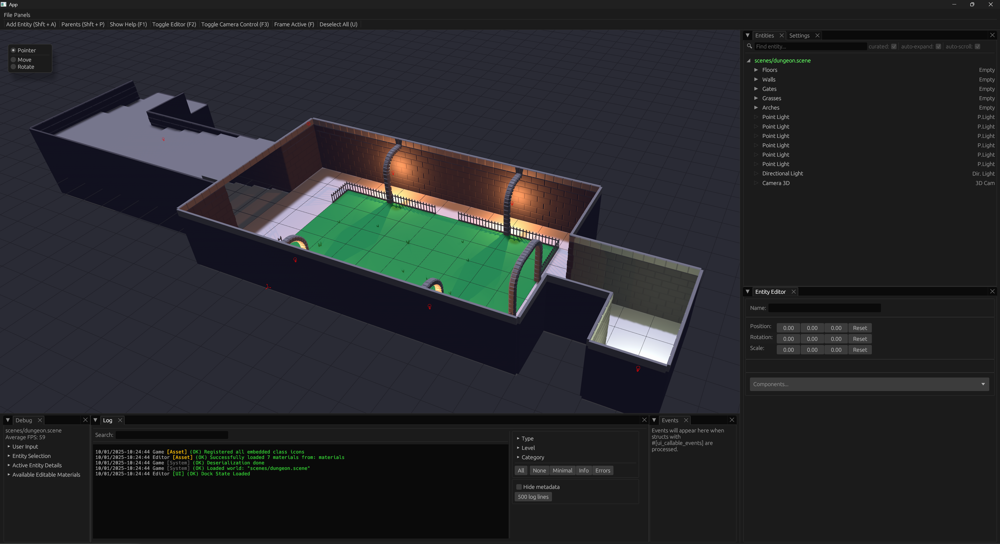
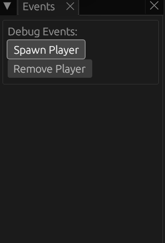

# Granite Bevy Editor

This crate provides a way to interactively create, edit, save, and load Bevy data in 3D.

```
Caution: This is in early development and you will likely encounter bugs
```




## Getting Starting

Navigate to your projects Cargo.toml, or create a fresh rust project with cargo new.

Be sure to use bevy 0.14 and link the bevy_granite plugin to my github repo. You can select alternate branches for more up-to-date releases. Also make sure you have the serde crate.
```rust
[dependencies]
bevy = "0.16.0"
bevy_granite = { git = "https://github.com/BlakeDarrow/bevy_granite", branch = "main" }
serde = "*"
```

There are 3 optional feature sets.
- Gizmos - Only loads needed content for gizmos. No editor or UI.
- Core - No Editor or Gizmos, just the bare bones needed to use our serial/deserial functions with macros and logging.
- Editor - The same as default features. Includes Gizmos, Core, and all Editor functionality.


## Examples

```ps
cargo run --release --example dungeon
```

Check out the [examples](https://github.com/BlakeDarrow/bevy_granite/tree/main/examples).

### Scene Format

An entity is stored as three main parts:
- **identity**: Contains the entity’s name, uuid, and type/class (such as Camera, Light, OBJ). This class data contains everything necessary to rebuild this bundle and any other adjacently relevant data. Not everything is currently available in classes.
- **transform**: Describes the entity’s position, rotation, and scale. This determines where the entity is located and how it is oriented in the world.
- **components**: (Optional) Holds additional data or behaviors attached to the entity. This is where you extend the entity’s functionality via the `#[granite_component]` macro.

Check out the [assets](https://github.com/BlakeDarrow/bevy_granite/tree/main/assets/scenes) for scene examples.


### UI Callable Events

With version 0.2.x, there is a new window that renders users buttons that are clickable. Create a struct that holds your events, and add `#[ui_callable_events]`. This will add all the events to the events window as clickable, and will dispatch said event in your struct.

<details>
<summary>Example</summary>

```Rust
use crate::*;
#[derive(Event, Default)]
pub struct DebugRequestPlayer;

#[derive(Event, Default)]
pub struct DebugRequestRemovePlayer;

#[ui_callable_events] # <- HERE
pub struct DebugEvents {
    pub spawn_player: DebugRequestPlayer,
    pub remove_player: DebugRequestRemovePlayer,
}

pub fn debug_callable_watcher(
    mut despawn: EventReader<DebugRequestRemovePlayer>,
    mut spawn: EventReader<DebugRequestPlayer>,
    mut commands: Commands,
    mut player_start: Query<(&GlobalTransform, &mut PlayerSpawner)>,
    mut world_state: ResMut<WorldState>,
) {
    for DebugRequestRemovePlayer in despawn.read() {
        commands.send_event(RequestDespawnBySource(PLAYER_PREFAB.to_string()));
    }

    for DebugRequestPlayer in spawn.read() {
        spawn_player(&mut commands, &mut world_state, &mut player_start);
    }
}
```



</details>

## Documentation

While comprehensive documentation is currently unavailable, here are some helpful events you can use to interact with the editor while I write said documentation:

<details>
<summary>Events</summary>

### Editor Control Events

- `RequestEditorToggle` - Toggle the editor UI on/off
- `RequestToggleCameraSync` - Toggle camera synchronization between editor and main camera

### Entity Selection Events
- `RequestSelectEntityEvent` - Select an entity (additive for multi-selection)
- `RequestDeselectEntityEvent` - Deselect a specific entity
- `RequestDeselectAllEntitiesEvent` - Clear all entity selections
- `RequestCameraEntityFrame` - Frame the UI camera to focus on active entity

### Entity Duplication Events
- `RequestDuplicateEntityEvent` - Duplicate a specific entity
- `RequestDuplicateAllSelectionEvent` - Duplicate all currently selected entities

### Entity Hierarchy Events
- `RequestNewParent` - Request to set active as parent for selected entities
- `RequestRemoveParents` - Remove parent relationships from selected entities
- `RequestRemoveChildren` - Remove child relationships from selected entities

### World Management Events
- `RequestSaveEvent` - Save the specific world
- `RequestLoadEvent` - Load a world from specified path
- `RequestReloadEvent` - Reload a world from specified path
- `WorldLoadSuccessEvent` - Event sent when world loading completes successfully
- `WorldSaveSuccessEvent` - Event sent when world saving completes successfully
- `RequestDespawnSerializableEntities` - Event to despawn all serializable entities
- `RequestDespawnBySource` - Event to despawn a specific source that is loaded


</details>

## Feedback

If you have any feedback, please reach out to me via a [GitHub issue](https://github.com/BlakeDarrow/bevy_granite/issues). I look forward to maintaining and improving this tool and am happy to hear y'alls opinions, but please keep it constructive.

## Support Table

This project was started when bevy 0.14 was just released, and I haven't upgraded since this. This is my top priorty to bring new bevy features into the editor.

| bevy | bevy_granite |
| ---- | ------------ |
| 0.16 | 0.2.0        |
| 0.15 | None         |
| 0.14 | 0.1.0        |

## License

Granite is free and open source. Except when noted, all assets are licensed under either:

- MIT License (LICENSE-MIT or http://opensource.org/licenses/MIT)
- Apache License, Version 2.0 (LICENSE-APACHE or http://www.apache.org/licenses/LICENSE-2.0)

## Contributing

Any sort of contributions are welcome! Open a pull request and I will be sure to look at it. If you are unsure of what you can fix or add, open an issue and lets talk about it. Though again I will add our frist priorty should be upgrading past bevy 0.14.

Any contributions by you, shall be dual licensed as above, without any additional terms or conditions.

## Media

<details>
<summary>Screenshots</summary>


</details>

## Special Thanks

 - Noah
 - Silas
 - Ethan
 - Max

## Creator 

- [@BlakeDarrow](https://www.youtube.com/@blakedarrow) on YouTube

